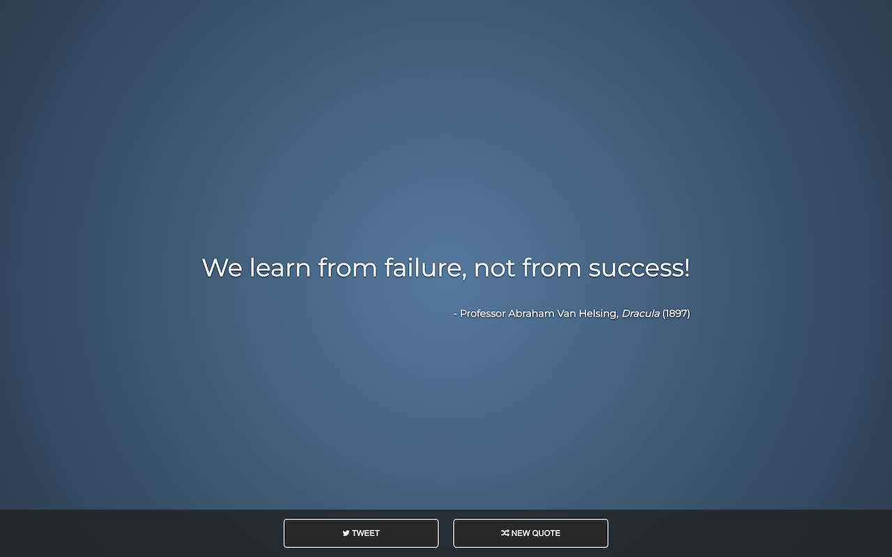

# Random Quote Machine

This project is a Random Quote Machine, developed as a part of the freeCodeCamp curriculum. It displays random quotes with the ability to tweet the current quote.



## Table of Contents
- [Overview](#overview)
- [Demo](#demo)
- [Features](#features)
- [Installation](#installation)
- [Usage](#usage)
- [Technologies Used](#technologies-used)
- [Contributing](#contributing)
- [Acknowledgments](#acknowledgments)
- [License](#license)
- [Author](#author)

## Overview

The Random Quote Machine is a web application developed as part of the freeCodeCamp curriculum. The main goal of this project is to create a simple and interactive page that displays random quotes along with their sources. Users can also tweet their favourite quotes directly from the application.

## Demo

View the live demo on CodePen: [Random Quote Machine](https://codepen.io/karlhorning/pen/zKewaN)

## Features

- Display random quotes with source information.
- Change background colour on quote change.
- Tweet the current quote.

## Installation

1. Clone the repository:

   ```bash
   git clone https://github.com/Karl-Horning/random-quote-machine.git
   ```

2. Open the project folder:

   ```bash
   cd random-quote-machine
   ```

3. Open the `index.html` file in your web browser.

## Usage

- Click the "New Quote" button to get a random quote.
- Click the "Tweet" button to share the current quote on Twitter.

## Technologies Used

- HTML
- CSS
- JavaScript

## Contributing

Contributions are welcome! If you find any bugs or want to add new features, feel free to open an issue or submit a pull request.

## Acknowledgments

I would like to express my gratitude to the following individuals and resources that have contributed to the development of the Random Quote Machine project:

- **freeCodeCamp Community:** A big thank you to the freeCodeCamp community for providing valuable learning resources and a supportive environment for developers.

- **Font Awesome:** The use of Font Awesome icons in this project adds a stylish and functional element. Thanks to Font Awesome for providing a great library of icons.

- **Google Fonts:** The project utilizes the Montserrat font from Google Fonts, enhancing the overall visual appeal and readability.

- **BootstrapCDN:** The project benefits from BootstrapCDN for including the Font Awesome and Montserrat font libraries. This service simplifies the process of integrating external resources into the project.

These resources and communities have played a significant role in the development journey of the Random Quote Machine, contributing to its functionality and aesthetics.

## License

This project is licensed under the [MIT License](LICENSE).

## Author

Karl Horning: [GitHub](https://github.com/Karl-Horning/) | [LinkedIn](https://www.linkedin.com/in/karl-horning/) | [CodePen](https://codepen.io/karlhorning)